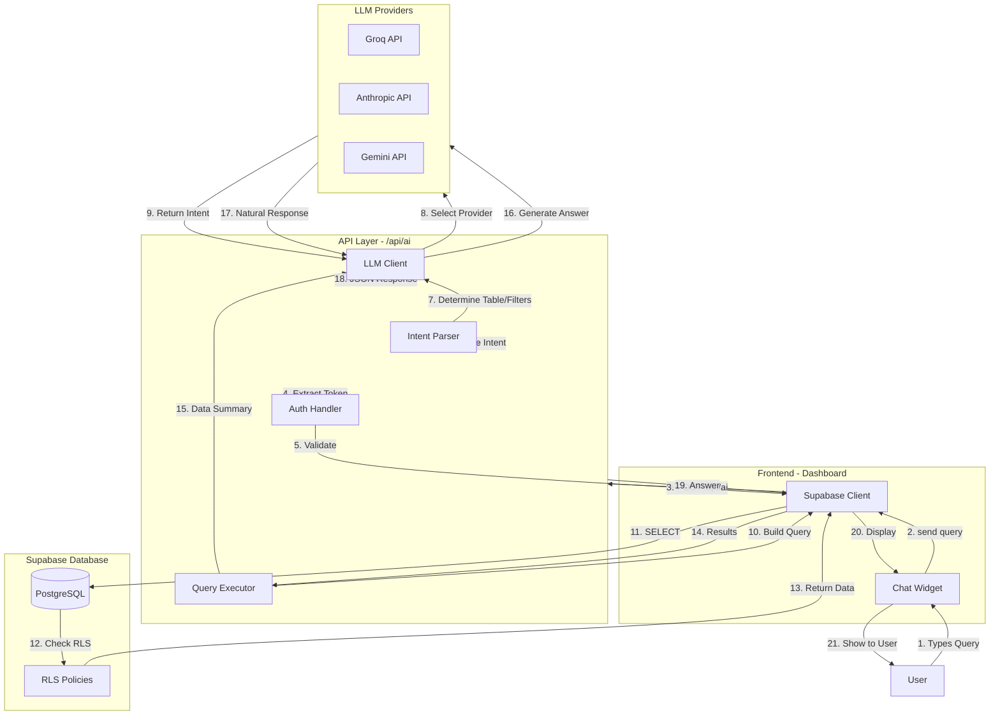
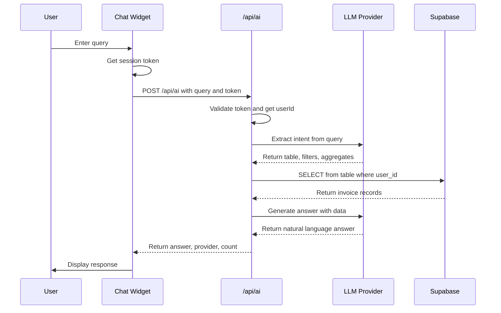
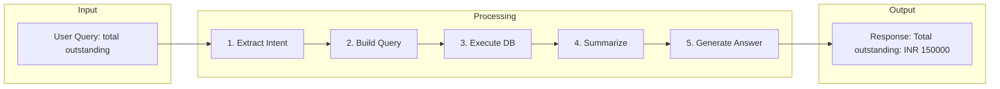
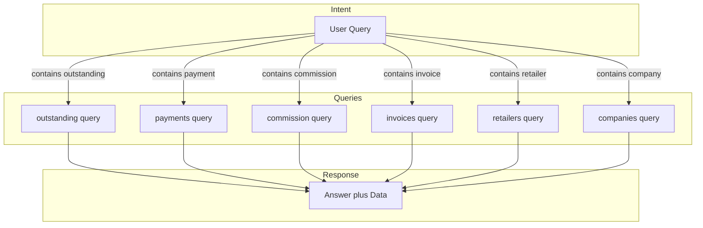

# AI Backend Architecture

## System Flow Diagram



## Sequence Diagram



## Data Flow



## Database Query Mapping



## File Structure

```
src/
├── lib/
│   └── ai/
│       ├── client.ts        # LLM client (Groq/Anthropic/Gemini)
│       └── schema.ts       # Database schema context
│
└── app/
    └── api/
        └── ai/
            └── route.ts    # Main API endpoint
```

## Environment Variables

```env
# Required
GROQ_API_KEY=gsk_...        # Groq API key

# Optional (fallback order: groq then anthropic then gemini)
ANTHROPIC_API_KEY=sk-ant-...
GEMINI_API_KEY=...
```

## API Contract

### Request
```json
POST /api/ai
{
  "query": "total outstanding"
}
```

### Response
```json
{
  "answer": "Total outstanding: INR 150000",
  "provider": "groq",
  "debug": {
    "userId": "abc123...",
    "table": "invoices"
  },
  "summary": "Outstanding: 150000, Count: 5",
  "count": 5
}
```

## Supported Queries

| Query Type | Table | Aggregation |
|------------|-------|-------------|
| outstanding, due | invoices | SUM(outstanding_amount) |
| payments, received | invoice_payments | SUM(amount) |
| commission | invoice_commissions | SUM(commission_amount) |
| invoice | invoices | COUNT |
| retailer | retailers | COUNT |
| company | companies | COUNT |