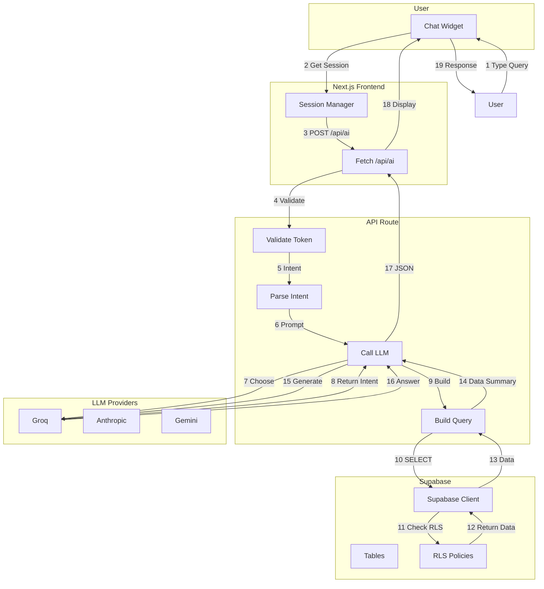
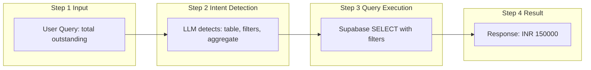
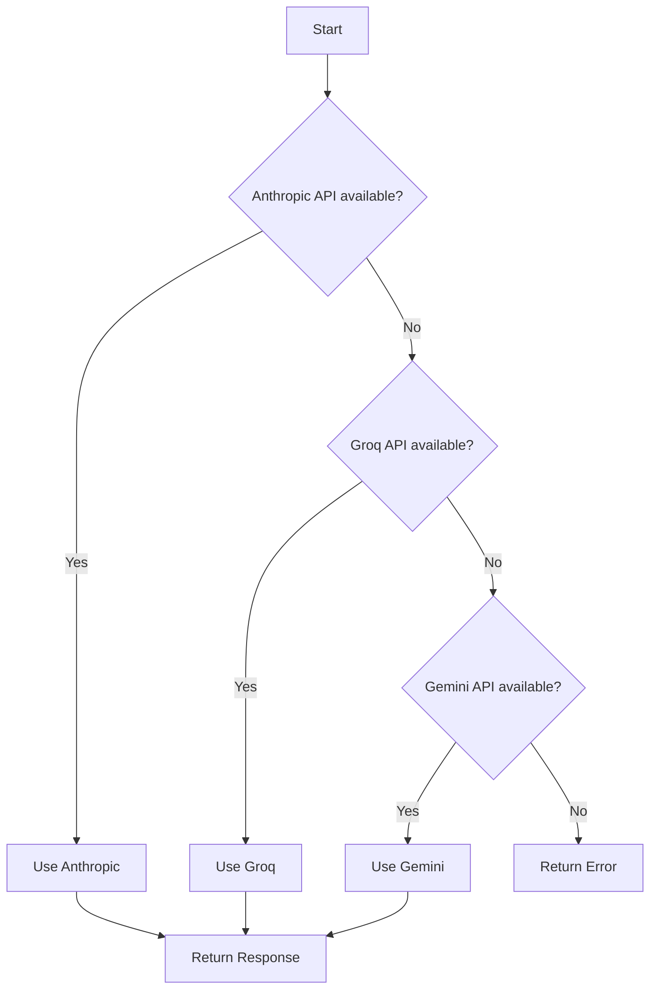
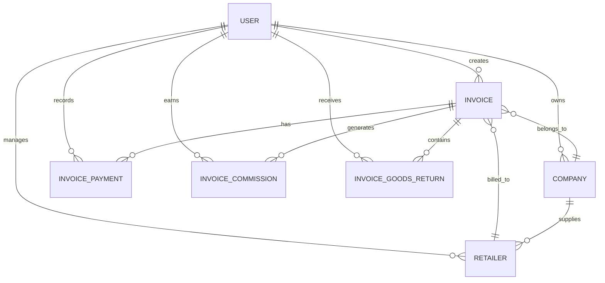
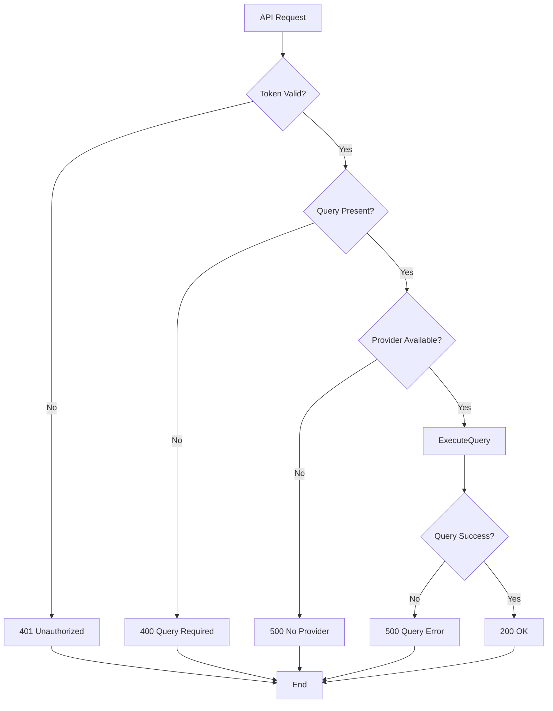
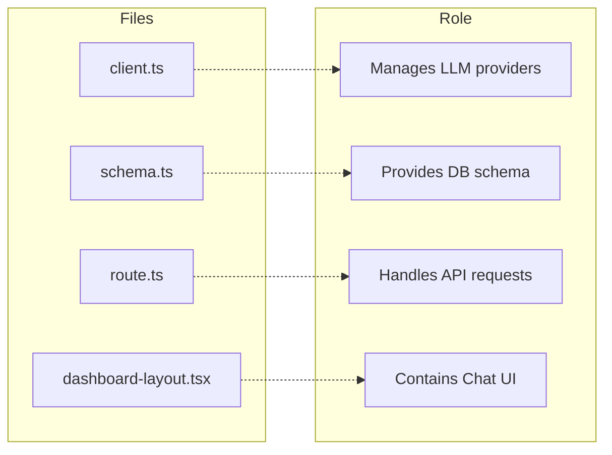

# Flow Diagram

## Full System Flow



## Query Processing Flow



## LLM Provider Selection



## Database Query Mapping



## Error Handling Flow



## Key Files and Their Role



## Data Format

### Input (from Chat)
```json
{
  "query": "total outstanding from company ABC"
}
```

### Output (to Chat)
```json
{
  "answer": "Total outstanding from ABC company is INR 150000",
  "provider": "groq",
  "summary": "Outstanding: 150000, Count: 5",
  "count": 5
}
```