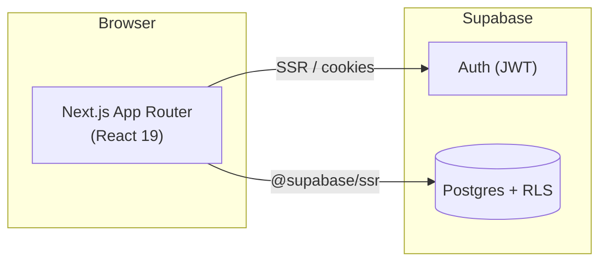
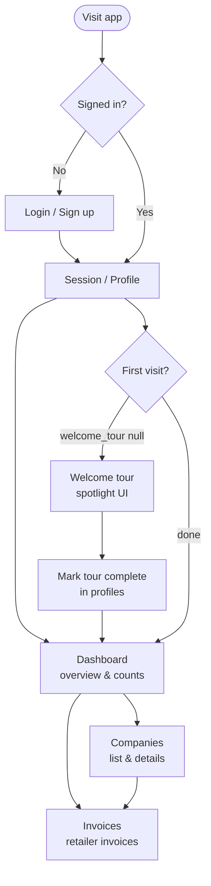
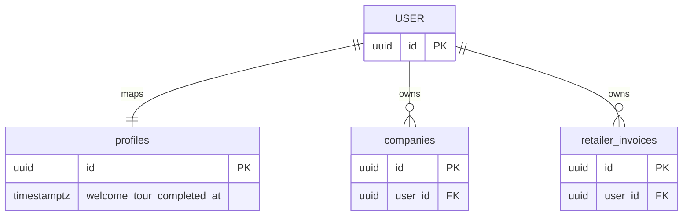
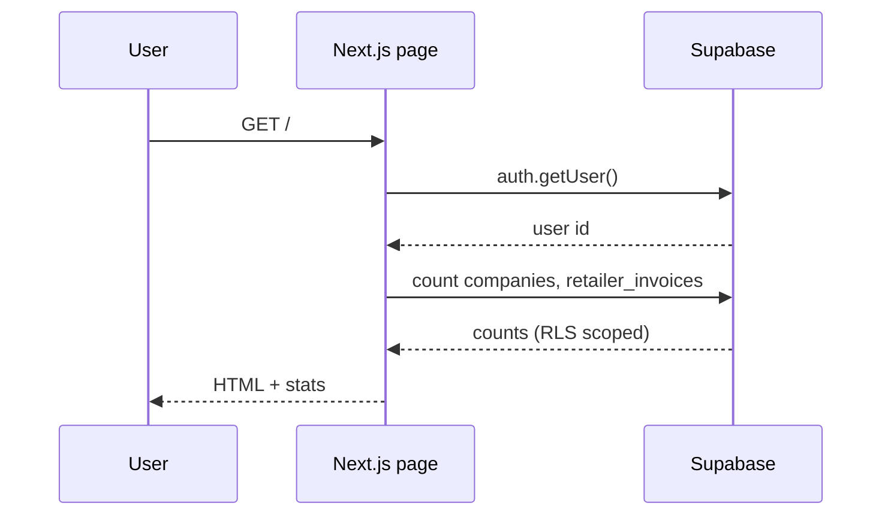

<div align="center">


# Invoice Manager

**Manage companies and retailer invoices in one place.**

A mobile-friendly [Next.js](https://nextjs.org) dashboard backed by [Supabase](https://supabase.com) (Auth, Postgres, Row Level Security).

[](https://nextjs.org/)
[](https://supabase.com/)
[](https://www.typescriptlang.org/)

</div>

---

## Overview

Invoice Manager helps you:

- Track **companies** you work with  
- Create and manage **retailer invoices**  
- See **dashboard stats** (counts at a glance)  
- Complete a **welcome tour** on first sign-in  
- Use **light / dark** themes  

---

## Screenshots & branding

| | |
|:--|:--|
| **Logo** |  |
| **UI** | *Add your own screenshots:* place PNGs under `docs/screenshots/` and link them here, e.g. ``. |

---

## Architecture

How the app talks to Supabase:



---

## User flow (high level)

From sign-in through daily use:



---

## Data model (simplified)

Core tables and relationships:



> `USER` stands in for Supabase **`auth.users`**. Table names match your migrations under `supabase/migrations/`—adjust the diagram if your schema diverges.

---

## Request flow (dashboard counts)

Example: loading the home dashboard:



---

## Getting started

### Prerequisites

- Node.js 20+  
- A [Supabase](https://supabase.com) project  

### Environment

Create `.env` in the project root:

```bash
NEXT_PUBLIC_SUPABASE_URL=https://your-project.supabase.co
NEXT_PUBLIC_SUPABASE_ANON_KEY=your-anon-key
```

### Install & run

```bash
npm install
npm run dev
```

Open [http://localhost:3000](http://localhost:3000).

### Database

Apply migrations (CLI or SQL editor):

```bash
supabase db push
# or run files in supabase/migrations/ in order
```

---

## Scripts

| Command | Description |
|--------|-------------|
| `npm run dev` | Development server |
| `npm run build` | Production build |
| `npm run start` | Run production server |
| `npm run lint` | ESLint |

---

## Project layout (short)

| Path | Role |
|------|------|
| `src/app/` | App Router routes (`(dashboard)`, auth, etc.) |
| `src/components/` | UI (dashboard, companies, invoices, theme) |
| `src/lib/supabase/` | Supabase client (server & browser) |
| `supabase/migrations/` | SQL schema & RLS |

---

## Learn more

- [Next.js documentation](https://nextjs.org/docs)  
- [Supabase docs](https://supabase.com/docs)  

---

<div align="center">

**Invoice Manager** — *Manage your business, effortlessly.*

</div>
